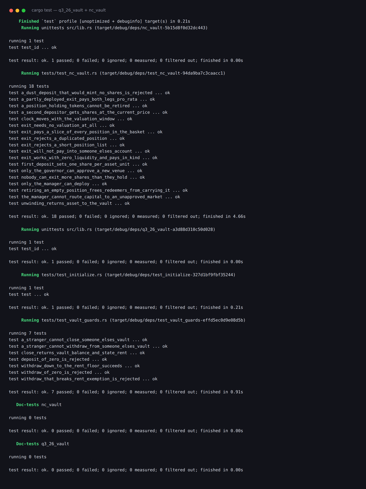

# Vaults — `q3_26_vault` and `nc_vault`

Two Anchor programs in one workspace.

**`q3_26_vault`** is the class vault: a personal SOL vault, one per user, with `initialize`, `deposit`, `withdraw` and `close`.

**`nc_vault`** is the advanced extension: a non-custodial share vault that pools an SPL asset, lets a manager route it into market positions, and lets any holder **exit at any time — in kind — even when the vault holds no liquid asset at all.**

Built with **Anchor 1.1.2**, tested with **LiteSVM** in Rust. 28 tests, all passing.

| Program | ID |
|---|---|
| `q3_26_vault` | `aNksHVU3gU1mjCPtTBsVk9S7qokAUvXfotB2jBxQQvv` |
| `nc_vault` | `HVEPaNfpQksnVs9ZYYenMdAtzvJ9cshQF3reabBfv68L` |

---

# Part 1 — `q3_26_vault`

A SOL vault keyed to its owner. Two PDAs per user: a `VaultState` record and a bare `SystemAccount` that holds the lamports.

```
[b"state", user]  ──▶  VaultState { vault_bump, state_bump }
[b"vault", user]  ──▶  SystemAccount, holds the SOL
```

Both are derived from the user's key, so the seeds constraint *is* the access control — a different signer derives different addresses and the transaction is rejected during account validation.

## Instructions

| Instruction | What it does |
|---|---|
| `initialize` | Creates `vault_state`, funds `vault` to its rent-exempt minimum, records both bumps |
| `deposit(amount)` | Moves lamports user → vault. Rejects zero. |
| `withdraw(amount)` | Moves lamports vault → user, vault PDA signing. Rejects zero, and refuses to break rent exemption. |
| `close` | Sweeps the entire vault balance to the user and closes `vault_state`, returning its rent |

## The two decisions worth explaining

**Why `withdraw` refuses to empty the vault.** The vault is a system account with no data. Its rent-exempt floor is `Rent::get()?.minimum_balance(0)`. Take it below that and the runtime reaps the account — while `vault_state` is still on chain pointing at an address that no longer exists, with a bump for a PDA holding nothing. The next `deposit` would then have to recreate it, and the invariant "state exists ⇒ vault exists" is gone. So:

```rust
let rent_exempt = Rent::get()?.minimum_balance(self.vault.data_len());
let available = self.vault.lamports().saturating_sub(rent_exempt);
require!(amount <= available, ErrorCode::InsufficientFunds);
```

`saturating_sub` rather than `-`: if the vault is somehow already below the floor, `available` is 0 and every withdrawal is refused, which is the safe direction.

**Why `close` is allowed to do the thing `withdraw` refuses.** `close` sweeps everything including the reserve, deliberately — the vault *should* disappear here, because `vault_state` is being closed in the same transaction. Anchor's `close = user` runs after the instruction body, so the body can still read `vault_state.vault_bump` before the account is zeroed.

**Why the bumps are stored.** `bump = vault_state.vault_bump` makes the runtime do a single `create_program_address` check. Writing `bump` alone would make it search downward from 255 for the canonical bump — the same answer, more compute, on every single instruction.

## PDA signing

A PDA has no private key. The program signs on its behalf by handing the runtime the exact seeds:

```rust
let signer_seeds: [&[&[u8]]; 1] =
    [&[VAULT_SEED, user_key.as_ref(), &[self.vault_state.vault_bump]]];
```

The seeds must match the derivation in the accounts struct exactly, bump included. This works for the vault specifically because it is a *system* account with zero data — the System program's transfer will not move lamports out of an account that carries data.

## Test coverage — 9 tests

(8 integration tests plus the `test_id` unit test Anchor generates.)

`tests/test_initialize.rs`

| Test | Covers |
|---|---|
| `test` | initialize → deposit → withdraw → close, asserting the vault balance at each step and that `vault_state` is gone at the end |

`tests/test_vault_guards.rs`

| Test | Covers |
|---|---|
| `deposit_of_zero_is_rejected` | `InvalidAmount` |
| `withdraw_of_zero_is_rejected` | `InvalidAmount` |
| `withdraw_that_breaks_rent_exemption_is_rejected` | `InsufficientFunds` when asking for the full balance |
| `withdraw_down_to_the_rent_floor_succeeds` | The exact boundary |
| `a_stranger_cannot_withdraw_from_someone_elses_vault` | `ConstraintSeeds` |
| `a_stranger_cannot_close_someone_elses_vault` | `ConstraintSeeds` |
| `close_returns_vault_balance_and_state_rent` | The user gets back the balance *and* the state account's rent, less the tx fee |

---

# Part 2 — `nc_vault`, the non-custodial vault

> **Advanced extension challenge 5:** *design the vault to be non-custodial, such that users can redeem their vault position in kind (for an underlying market position, even when the vault has no available liquidity) and users can exit anytime.*

## The problem

A vault that only takes deposits and gives them back is easy. A vault that *puts the money to work* is where custody creeps in. Once the pooled asset has been deployed into a market, there may be nothing liquid left to pay a withdrawal with.

Every custodial answer to that is a lever someone holds over depositors:

- a **withdrawal queue** — you leave when the manager gets to you;
- a **notice period** — you leave when the manager says;
- **"withdrawals paused"** — you do not leave;
- a **manager-processed redemption** — you leave if the manager is alive, honest, and online.

Each is a place where a depositor's money depends on someone else's behaviour. That is what "custodial" means in practice, whatever the account ownership diagram says.

## The answer

**Hand over the positions themselves.**

If the vault cannot pay you in cash because it holds no cash, it pays you in what it does hold: your exact pro-rata slice of every position token in the book. You leave with the same basket the vault holds, in the same proportions. Illiquidity becomes *your* problem to solve on the open market — which is a problem you can actually solve — instead of a lever the manager holds over you.

This is how ETF redemption baskets work, and it has a property worth pausing on: **it needs no prices.** Paying you a quarter of every position requires knowing only what the vault holds and what fraction of the shares you own. No oracle, no mark, no valuation. Nothing that can be stale, missing, manipulated, or disagreed with.

That single fact is what makes the exit unstoppable, and it is the design's centre of gravity.

```
  vault holds:   0 asset   +   500 LP tokens          Alice holds 500 of 1000 shares
                                                       (half the vault)

  exit(500 shares)
        │
        ├─ cash leg:      50% of 0        =   0 asset      ← zero, and that is fine
        └─ in-kind leg:   50% of 500 LP   = 250 LP tokens  ← paid in full
        
  no manager signature · no queue · no valuation read · no liquidity precondition
```

## What is trusted, and what is not

Being precise about this is the point of the exercise.

| Operation | Reads a price? | Who must cooperate | Can it be blocked? |
|---|---|---|---|
| `exit` | **no** | **nobody but the holder** | **no** |
| `deposit` | yes | needs a fresh mark | yes — a silent manager freezes deposits |
| `deploy` / `unwind` | no | manager + an approved market | n/a |

The asymmetry is deliberate. **Entry can wait for a good price. Exit never should.** A depositor who cannot enter is mildly inconvenienced; a depositor who cannot leave has been expropriated.

Two roles, separated on purpose:

- The **governor** decides *where* capital may go. `register_position` records a position mint and the single `market` address it may trade against.
- The **manager** decides *when and how much*, but only through venues the governor already approved.

`deploy` and `unwind` both carry `has_one = market` against the position record, so a manager cannot name a counterparty of their own choosing. That is the constraint standing between "manager routes capital" and "manager sends the vault's money to their own wallet", and there is a test that tries it with a fully-equipped rogue market and gets `ConstraintHasOne`.

## Share accounting

Shares are an SPL mint whose authority is the vault PDA. No key anywhere can mint one — shares come into existence only through `deposit` and leave only through `exit`. They are ordinary SPL tokens, so they transfer, and whoever holds them can exit.

**NAV** is the liquid asset balance plus every position marked at `amount × value_per_unit / VALUE_SCALE`, in `u128`.

**Deposit** mints `amount × supply / NAV`, or `amount` on the very first deposit, which sets the scale at one share per asset unit.

**Exit** pays `holding × shares / supply` out of the liquid balance and out of every position.

Every division floors. The remainder — at most one base unit per position — stays in the vault, so rounding can only ever favour the holders who have not left yet. Rounding the other way would let a stream of dust redemptions bleed the vault, which is a real attack, not a theoretical one.

`deposit` rejects a deposit too small to mint a whole share (`DepositTooSmall`) rather than silently taking the money and issuing nothing.

## Marks and staleness

`value_per_unit` is asset units per position unit, scaled by `VALUE_SCALE = 1_000_000`. Integer math throughout; there are no floats on-chain.

`deploy` and `unwind` do **not** let the manager assert a price — they compute it from the trade that just executed:

```rust
value_per_unit = asset_amount × VALUE_SCALE / position_amount
```

`revalue` exists for the drift between trades, and it is the one place a manager states a number. A wrong number there mis-prices *deposits* and nothing else.

Marks older than `max_valuation_age` block deposits with `StaleValuation`. So a manager who disappears freezes the door in, never the door out — there is a test that warps a year forward, watches `deposit` fail, and then exits successfully in the same breath.

## Accounts

**`Vault`** — PDA `[b"nc_vault", governor, seed]`

| Field | Purpose |
|---|---|
| `seed` | Lets one governor run several vaults |
| `governor` | Approves venues |
| `manager` | Routes capital within approved venues |
| `asset_mint` | The deposited asset |
| `share_mint` | PDA `[b"share", vault]`, mint authority = vault |
| `position_count` | How many positions exist — `deposit` and `exit` check their account lists against it |
| `max_valuation_age` | Staleness window for deposits, in seconds |
| `bump`, `share_mint_bump` | Stored for cheap re-derivation |

**`Position`** — PDA `[b"position", vault, position_mint]`

| Field | Purpose |
|---|---|
| `vault`, `position_mint` | Identity |
| `market` | The only counterparty this position may be traded with. Governor-set, manager-immutable. |
| `amount` | Position units held. **The only field `exit` reads.** |
| `value_per_unit` | Mark, for deposit pricing only |
| `last_valued` | Timestamp behind the staleness check |
| `bump` | |

## Instructions

| Instruction | Signer(s) | Notes |
|---|---|---|
| `initialize_vault(seed, manager, max_valuation_age)` | governor | Creates the vault, its share mint and its asset account |
| `register_position()` | governor | Approves a position mint + its market; creates the vault's token account for it |
| `deploy(asset_amount, position_amount)` | manager **and** market | Asset out, position tokens in — both legs, one transaction |
| `unwind(position_amount, asset_amount)` | manager **and** market | The reverse |
| `revalue(value_per_unit)` | manager | Refreshes a mark |
| `deposit(amount)` | anyone | Remaining accounts: every `Position`, ascending by key |
| `exit(shares)` | share holder | Remaining accounts: four per position, ascending |
| `close_position()` | governor | Retires a fully-unwound position and reclaims its rent |

Both legs of `deploy` settle in one instruction and the market has to sign, so there is no moment where the vault has paid out and holds nothing to show for it.

## The `remaining_accounts` design

`deposit` and `exit` both take a variable number of positions, so they read `ctx.remaining_accounts`.

`deposit` takes one account per position: the `Position` record, read-only.

`exit` takes four:

| Slot | Account | Writable |
|---|---|---|
| 0 | the `Position` record | yes |
| 1 | the position mint | no |
| 2 | the vault's token account for that mint | yes |
| 3 | the redeemer's token account for that mint | yes |

Three rules make this safe:

**1. The count must match `vault.position_count` exactly.** A redeemer who could omit a position would take the cash leg and skip the in-kind leg. A depositor who could omit one would be priced against an understated NAV and get too many shares.

**2. Positions must arrive in strictly ascending key order.** This is how duplicates are ruled out. Naming the same position twice would pay its pro-rata slice twice; ordering makes it impossible in one comparison per item instead of an O(n²) scan.

**3. Every account is validated on the way in.** `Account::try_from` checks the owning program and discriminator; on top of that the code re-derives the position PDA from its stored bump, and checks each token account's mint *and* owner. Without the owner check a redeemer could name someone else's account as the destination.

Because remaining accounts are outside the `Accounts` struct, Anchor will not serialize the mutated `Position` back automatically — `exit` calls `position.exit(&crate::ID)` explicitly after decrementing.

## The limit, stated plainly

A redeemer must pass every position in one transaction, so the account budget caps a vault at roughly a dozen positions. That is a real constraint and it is the design's main cost.

The way to lift it is a **paginated redemption receipt**: `request_exit` burns the shares and writes a receipt recording the numerator and denominator at burn time, then the holder claims each position in its own transaction. It removes the cap, and it gives up atomicity — a half-claimed receipt is a state that has to be reasoned about, and the position amounts have to be snapshotted at request time or later claims drift as other people exit.

For a vault holding a handful of venues, the atomic version is simpler, has no intermediate state, and is easier to be confident about. That is the trade made here, not an oversight.

## Test coverage — 19 tests

(The 18 integration tests below, plus the `test_id` unit test Anchor generates.)

**Share accounting**

| Test | Covers |
|---|---|
| `first_deposit_sets_one_share_per_asset_unit` | The initial scale |
| `a_second_depositor_gets_shares_at_the_current_price` | A trade at 2.0 leaves NAV unchanged; a revaluation to 4.0 makes the same deposit buy 326.09 shares instead of 500 |
| `a_dust_deposit_that_would_mint_no_shares_is_rejected` | `DepositTooSmall` |

**In-kind exit — the point of the exercise**

| Test | Covers |
|---|---|
| `exit_works_with_zero_liquidity_and_pays_in_kind` | Vault holds **zero** asset; the cash leg pays 0, the position leg pays the full pro-rata slice, and the books agree |
| `a_partly_deployed_exit_pays_both_legs_pro_rata` | Alice takes ⅔ of both legs; what remains is exactly Bob's third, and he takes it later |
| `exit_pays_a_slice_of_every_position_in_the_basket` | Two positions, fully deployed, redeemed in one shot |
| `exit_needs_no_valuation_at_all` | A year of manager silence: `deposit` fails `StaleValuation`, `exit` succeeds anyway |
| `retiring_an_empty_position_frees_redeemers_from_carrying_it` | After `close_position`, an exit carries no remaining accounts |

**Manager and market**

| Test | Covers |
|---|---|
| `unwinding_returns_asset_to_the_vault` | Round trip at a profit; the mark tracks the executed rate |
| `the_manager_cannot_route_capital_to_an_unapproved_market` | A rogue market with real accounts and a real signature still fails `ConstraintHasOne`; not a lamport moves |
| `only_the_manager_can_deploy` | `ConstraintHasOne` |
| `only_the_governor_can_approve_a_new_venue` | `ConstraintSeeds` |
| `a_position_holding_tokens_cannot_be_retired` | `PositionNotEmpty` |
| `clock_moves_with_the_valuation_window` | Just inside the window passes, one second past fails, a fresh mark reopens deposits |

**Redemption guards**

| Test | Covers |
|---|---|
| `exit_rejects_a_short_position_list` | `PositionCountMismatch` |
| `exit_rejects_a_duplicated_position` | With two positions registered the count check passes, and `PositionsOutOfOrder` is what stops the double payout — then the honest list succeeds |
| `exit_will_not_pay_into_someone_elses_account` | `WrongOwner` |
| `nobody_can_exit_more_shares_than_they_hold` | `InsufficientShares` |

---

## Build and test

Requires the Solana/Agave toolchain (`cargo-build-sbf`) and Rust 1.89 as pinned in `rust-toolchain.toml`.

```bash
# compile both programs to BPF — the tests load the resulting .so files
cargo build-sbf

# run every suite
cargo test

# or one program at a time
cargo test -p q3_26_vault
cargo test -p nc_vault
```

`cargo build-sbf` must run first. Each test binary pulls its program in with

```rust
include_bytes!(concat!(env!("CARGO_TARGET_TMPDIR"), "/../deploy/nc_vault.so"))
```

and loads it into LiteSVM with `svm.add_program`. No validator, no RPC — the whole suite runs in-process in a few seconds. Clock-dependent behaviour is tested by writing the Clock sysvar directly with `svm.set_sysvar::<Clock>`.



---

## Layout

```
programs/
├── q3_26_vault/
│   ├── src/
│   │   ├── lib.rs
│   │   ├── state.rs            # VaultState
│   │   ├── constants.rs        # VAULT_SEED, STATE
│   │   ├── error.rs
│   │   └── instructions/       # initialize, deposit, withdraw, close
│   └── tests/
│       ├── test_initialize.rs  # lifecycle
│       └── test_vault_guards.rs
└── nc_vault/
    ├── src/
    │   ├── lib.rs              # #[program], with the design rationale up top
    │   ├── state.rs            # Vault, Position
    │   ├── constants.rs        # seeds, VALUE_SCALE
    │   ├── error.rs
    │   ├── helpers.rs          # remaining-account validation, ordering, pro-rata math
    │   └── instructions/       # initialize_vault, register_position, deploy,
    │                           # unwind, revalue, deposit, exit, close_position
    └── tests/
        └── test_nc_vault.rs
```
